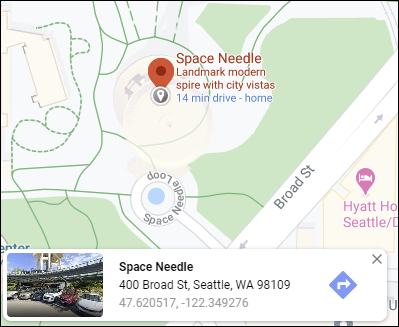

# Handling projections and coordinate systems {#crs}

```{r setup040, include=FALSE}
library(knitr)
library(pander)
library(kableExtra)
library(rgdal)

# path to this file name
if (!interactive()) {
    fnamepath <- current_input(dir = TRUE)
} else {
    fnamepath <- ""
}
```


## Projections and coordinate systems
Even well-seasoned GIS analysts can stumble over projections and coordinate systems.

A projection is simply a mathematical function for transforming the X and Y coordinates of a point in one spatial reference framework to X and Y coordinates in a different spatial reference framework.

Initially, any point on the earth can have its location specified by the degrees north or south of the equator (latitude) and west or east of the Greenwich meridian (longitude). These spherical coordinates can be transformed to Cartesian coordinates using tried and true projection transformation equations. For the geodesically inclined, see Snyder's comprehensive work, [Map Projections--A working Manual](http://pubs.usgs.gov/pp/1395/report.pdf).
 
For example, the Space Needle shows up in Google Maps at (-122.349276&deg;, 47.620517&deg;)



The same location on the USGS topographic sheet indicates tick marks for both UTM and State Plane coordinates. For the same location on the earth's surface, the WA State Plane North HARN coordinates are (1266575.4, 230021.7) ft, and the UTM Zone 10 N coordinates are (548894.1, 5274326.9) m.


__BONUS__ Why would you use a Cartesian projected coordinate reference system versus a geographic (latitude/longitude) reference system?

## On-the-fly projection in desktop GIS
How is it that we could not see the ZIP code outlines in our R map (Chapter \@(export)) when they appeared just fine in QGIS? Desktop GIS applications including ArcMap and QGIS employ "on-the-fly" projection. The software will read any existing coordinate reference system (CRS) tags associated with a data set (e.g., a `.prj` file as part of a shape file or a "world file" accompanying a TIFF or JPEG file). The software will transform the coordinates of the data to match the CRS of other data in the same map viewer. This process does not alter data in any way, but rather just changes display properties.

On-the-fly projection for mapping is highly convenient, particularly if you have many different data sets that originated from different agencies, each of which uses a different CRS standard. For example, some products from the USGS are referenced to latitude/longitude and some are referenced to UTM; the City of Seattle and King County uses WA State Plane North and the Washington State Departments of Transportation and Natural Resources uses WA State Plane South. 

However, there is a dark side. Although the layers appear to register correctly, any analyses performed between layers will not produce correct results. This is because the geoprocessing algorithms use the absolute numerical values of the coordinates as if they were drawn on a sheet of graph paper, without respect to whether those coordinates represent any particular CRS. For this reason, any for project involving GIS analysis using multiple data sources, the first step should be to decide on a single CRS and transform all data as necessary to be stored in that CRS.

Which CRS to use will depend on which distortion you want to minimize: area, shape, distance, or direction. See the [USGS Map Projections poster](images/00_map_projections_usgs.pdf) for details, which are beyond the scope of this workshop.


## Defining a data set's coordinate reference system
If you have a `sf` spatial data frame consisting of vector data or a raster data set (covered in Chapter \@(raster)) that is not tagged with its CRS, there are simple commands to do so: `st_crs()` for `sf` data frames and `crs()` for rasters. The function can be used to show the current CRS or to (re)define the CRS. The CRS can be specified in one of two ways, using [EPSG codes](http://www.epsg.org/), which uses numerical codes for different CRSs, or a `prj4` string, which verbosely lists all the parameters for a given CRS. Using EPSG codes is more convenient than using prj4 strings.

If you obtain a spatial data set, one of the things you need to be absolutely certain of is its CRS. Most data sets are provided with either files (e.g., `.prj` files for shape files) or internal metadata (e.g., embedded in a GeoTIFF), or at least a description of their CRS. If you do not know the CRS of your data, you can [make educated guesses](http://gis.washington.edu/phurvitz/gis_data/projection_exercise/).

In any case if you have a data set that has no CRS defined, although it may not be absolutely necessary, you should define its CRS in order to follow best practices.

Let's redo the exercise from Chapter \@(points) in which we created the Space Needle point, but not include the CRS:

```{r}
snxy <- data.frame(name = "Space Needle", x = -122.3493, y = 47.6205)
space_needle <- st_as_sf(snxy, coords = c("x", "y"))
```

When we look at its CRS, it shows `NA`:

```{r}
st_crs(space_needle)
```

Because we knew in advance that these coordinates were stored in WGS84 (EPSG 4326), we can now set the data frame's CRS:

```{r}
st_crs(space_needle) <- 4326
st_crs(space_needle)
```

Note that setting the data frame's CRS does not change any coordinate XY values, it is only metadata.

If you want a list of EPSG codes and their descriptions and proj4 values, use the `rgdal` package's `make_EPSG` function. For example what if we wanted the EPSG code for UTM Zone 10 N ...

```{r}
epsg <- make_EPSG()
utm10 <- epsg[grep("UTM.*10", epsg$note),]
kable(utm10) %>% kable_styling(bootstrap_options = "striped", full_width = F, position = "left")
```

... or if we wanted to find out what EPSG code 2927 is:

```{r}
kable(epsg %>%filter(code == 2927)) %>% kable_styling(bootstrap_options = "striped", full_width = F, position = "left")
```


## Coordinate transformation
If you have a data set stored in one CRS and you want to transform its coordinates to match another CRS, use `st_transform()` for `sf` data frames or the `projctRaster()` function for raster data sets.

Here we will make a new Space Needle point stored with UTM 10 NAD83. Note the changed coordinates shown in the `geometry` column.

```{r}
(space_needle_utm10 <- space_needle %>% st_transform(26910))
```

Or if you want to overwrite the data of an existing data frame with a new CRS:


```{r}
(space_needle <- space_needle %>% st_transform(26910))
```

which should be done with care because it alters the values of an existing data set.
