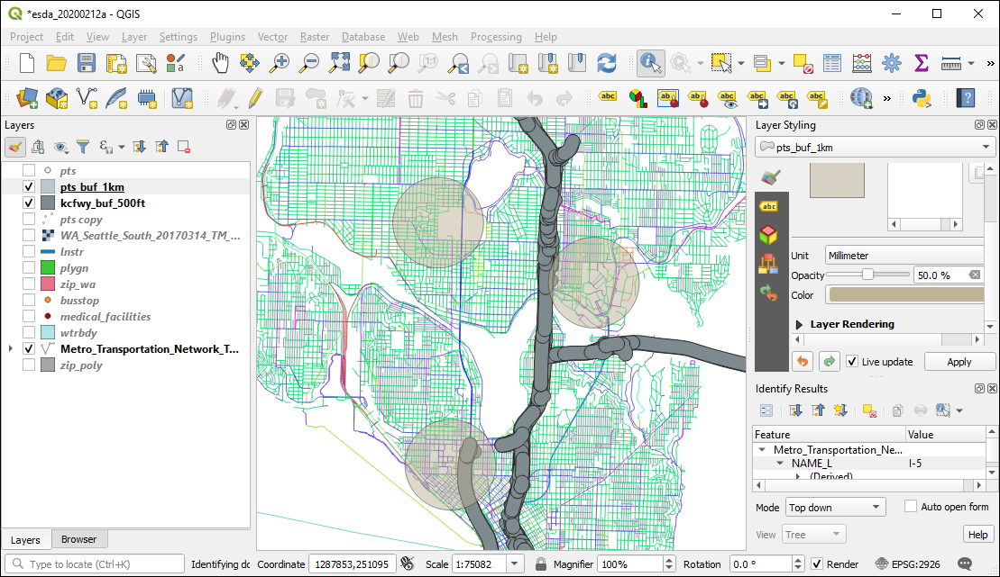
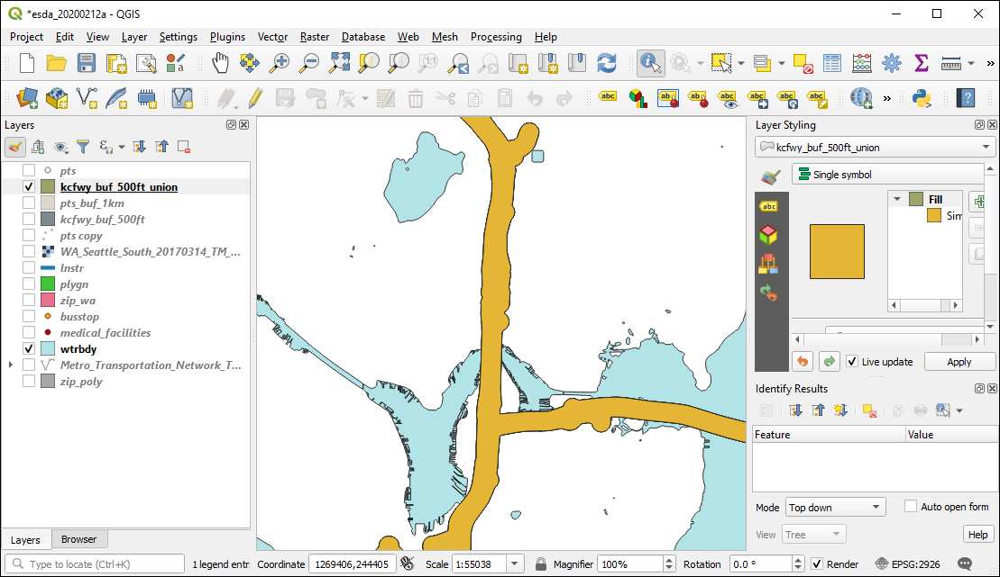
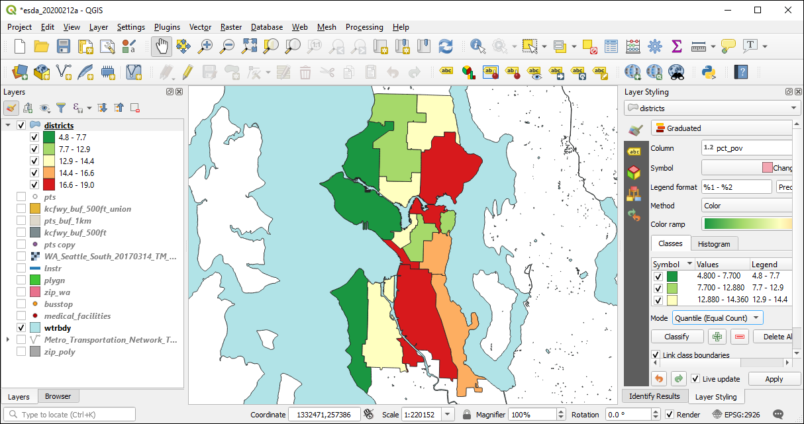

# Geoprocessing {#geoprocessing}

```{r setup050, include=FALSE}
# path to this file name
if (!interactive()) {
    fnamepath <- current_input(dir = TRUE)
} else {
    fnamepath <- ""
}

library(sf)
library(tidycensus)
library(ggplot2)
```

Make sure that `mydatadir` points to the location where the GIS data files were downloaded and unzipped.

```{r mydd050}
mydatadir <- "H:/gis_in_r/data"
```

## Buffering
Buffering is one of the most common geoprocessing techniques. `sf` provides the `st_buffer()` command to create Euclidean buffers around vector features. 

Let's create 1 km buffers around the points we created earlier. For this process, first we transform the points to UTM 10 so when we specify a buffer distance of 1,000 that translates to 1 km, and finally we transform to WA State Plane N. 

```{r buf1}
# create the points
snxy <- data.frame(name = "Space Needle", x = -122.3493, y = 47.6205)
space_needle <- st_as_sf(snxy, coords = c("x", "y"), crs = 4326)
shxy <- data.frame(name = "Savery Hall", x = -122.3083, y = 47.6572)
savery_hall <- st_as_sf(shxy, coords = c("x", "y"), crs = 4326)
zooxy <- data.frame(name = "Woodland Park Zoo", x = -122.3543, y = 47.6685)
wp_zoo <- st_as_sf(zooxy, coords = c("x", "y"), crs = 4326)
pts <- rbind(space_needle, savery_hall, wp_zoo)

# make the buffer with inline transforms
pts_buf_1km <- pts %>% st_transform(26910) %>% st_buffer(dist = 1000) %>% st_transform(2926)
```

Export the point buffers to our GPKG:

```{r export1}
# write to the GPKG
mygpkg <- file.path(mydatadir, "r_gis.gpkg")
st_write(obj = pts_buf_1km,
         dsn = mygpkg,
         layer = "pts_buf_1km",
         quiet = TRUE,
         append = TRUE,
         delete_layer = TRUE)
```

We will also make 500 ft buffers around the freeways of King County and export them to the GPKG

```{r buf2}
if(! exists("kctrans")){
    kctrans <- st_read(
        file.path(mydatadir, "Metro_Transportation_Network_TNET_in_King_County__trans_network_line.shp"),
        quiet = TRUE)
}

# freeways are KC_FCC_ID = F
kcfwy <- kctrans %>% filter(KC_FCC_ID == "F")

# buffer
kcfwy_buf_500ft <- kcfwy %>% st_transform(2926) %>% st_buffer(500)

# write to the GPKG
mygpkg <- file.path(mydatadir, "r_gis.gpkg")
st_write(obj = kcfwy_buf_500ft, dsn = mygpkg, layer = "kcfwy_buf_500ft", quiet = TRUE, update = TRUE)
```

What the !#*$&? Why are there all those little tiny buffers around the freeway lines? To be addressed below.... 




## Point-in-polygon
For the next analysis, we will [tabulate the density of transit stops in each census block group](https://csde.washington.edu/workshop/introduction-to-gis/) and then look for patterns in transit stop density by median household income.

First we need to get the census block groups and median family income using `tidycensus`. Covering the use of `tidycensus` is beyond the scope of this workshop; for an introduction, see the [Computational Demography seminar presented by Connor Gilroy and Neal Marquez](https://csde-uw.github.io/tidycensus-tutorial/). 

Using pipes in `magrittr`, we perform an inline CRS transformation to WA State Plane N and also calculate the area of each bloc group (which we will need for the density measurement later).

If you did not get your census API key, you will need to load the layer from the [`census.gpkg`](http://staff.washington.edu/phurvitz/r_gis/data/census.gpkg.zip) file:

```
acs5_2018_bg <- st_read(dsn = file.path(mydatadir, "census.gpkg"), layer = "acs5_2018_bg", quiet = TRUE)
st_crs(acs5_2018_bg) <- 2926
```

```{r census1}
# cache data
options(tigris_use_cache = TRUE)
# where to store data
tigris_cache_dir <- mydatadir

# if you have your API key, enter it here rather than using the system environment variable
# myapikey <- "foobar"
myapikey <- Sys.getenv("CENSUS_API_KEY")
census_api_key(myapikey)

# get the data and project it to match the bus stops, also calculate the area
acs5_2018_bg <- get_acs(
    geography = "block group",
    variables = c(medfamincome="B19113_001"),
    state = "WA",
    county = "King",
    geometry = TRUE,
    moe = 95,
    cache_table = TRUE, 
    output = "wide") %>%
    st_transform(2926)  %>%
    mutate(area_ft = as.numeric(st_area(.)))

colnames(acs5_2018_bg) <- tolower(colnames(acs5_2018_bg))
```

Quickly view the data in a `ggplot()`:

```{r ggplot1}
acs5_2018_bg %>%
    ggplot() +
    geom_sf(aes(fill = medfamincomee), size = .25) +
    scale_fill_viridis_c() + 
    theme_void()
```

Load the bus stops:

```{r busstop}
busstop <- st_read(
    file.path(mydatadir, "busstop/busstop.shp"), quiet = TRUE) 
st_crs(busstop) <- 2926
colnames(busstop) <- tolower(colnames(busstop))
```

First, let's look at the column names in `busstop`:

```{r busstop2}
print(colnames(busstop))
```

To get the census data as an attribute on each transit stop, use `st_join()`:

```{r join1}
busstop <- busstop %>% st_join(acs5_2018_bg)
```

We now see that there are additional variables, particularly `medfamincomee`:

```{r print1}
print(colnames(busstop))
```

To calculate density we need a total count of transit stops by census unit id (`GEOID`) as well as the area. Note because all variables are identical within each census units, we can use `medfamincomee = min(medfamincomee)` in the summarize function.

```{r tab}
# tabulate the count of transit stops
nbusstop <- busstop %>% 
    group_by(geoid) %>% 
    summarise(n_busstop = n(), 
              density_ha = n() / min(area_ft) * 107639 , 
              medfamincomee = min(medfamincomee))
```

Let's make a scatter plot with a regression line and error.

```{r scatterplot}
nbusstop %>% ggplot(aes(x = medfamincomee, y = density_ha)) + 
    geom_point() + 
    geom_smooth(method = "lm") +
    xlab("block group median family income, ACS-5, 2018") + ylab("transit stop density per ha")

```

Looks like no relationship exists. How about some formal statistics?

```{r lm}
pander(
    summary(
        lm(data = nbusstop, medfamincomee ~ density_ha)))
```


## Polygon-on-polygon

### Intersect
For the next exercise we will estimate the proportion of persons living below the federal poverty level within Seattle neighborhoods using 2018 ACS data at the tract level (poverty data are not available at the block group level).

First we will load the city neighborhood boundaries, including a CRS transformation to WA State Plane N:

```{r nhoods}
nhood <- st_read(
    file.path(mydatadir, "Community_Reporting_Areas.shp"), 
    quiet = TRUE) %>%
    st_transform(2926)
names(nhood) = tolower(names(nhood))
```

Get the tract data for the total count of persons for whom poverty status was determined and the count of persons living below the poverty level, also transforming to WA State Plane N and calculating the area of the tract.

If you did not get your census API key, you will need to load the layer from the [`census.gpkg`](http://staff.washington.edu/phurvitz/r_gis/data/census.gpkg.zip) file:

```
acs5_2018_trt <- st_read(dsn = file.path(mydatadir, "census.gpkg"), layer = "acs5_2018_trt", quiet = TRUE)
st_crs(acs5_2018_trt) <- 2926
```

```{r, message = FALSE}
# get the data and project it to match the bus stops, also calculate the area
acs5_2018_trt <- get_acs(
    year = 2018,
    geography = "tract",
    variables = c(n="B06012_001", n_pov="B06012_002"),
    state = "WA",
    county = "King",
    geometry = TRUE,
    moe = 95,
    cache_table = TRUE, 
    output = "wide") %>%
    st_transform(2926) %>%
    mutate(area_ft_tract = as.numeric(st_area(.)))

colnames(acs5_2018_trt) <- tolower(colnames(acs5_2018_trt))

```

Intersecting the tracts and neighborhoods will produce a polygon data set with data only for the area in common between both data sets. It will also subdivide polygons wherever there is an overlap between polygons from the different input layers. We also calculate the area of the resultant polygons ("slivers") for estimating person counts within each sliver using area weighting under the (arguably incorrect) assumption that the population is uniformly distributed across the tract. The estimate of the count of persons within each sliver is calculated as 

$$pop_{sliver} = pop_{tract} \times \frac{area_{sliver}}{area_{original}}$$

```{r intersect}
nhood_trt <- st_intersection(x = nhood, acs5_2018_trt) %>% 
    mutate(area_ft_intersect = as.numeric(st_area(.)),
           n_est = ne * as.numeric(st_area(.)) / area_ft_tract, 
           n_est_pov = n_pove * as.numeric(st_area(.)) / area_ft_tract)
```

We then sum the area-weighted counts for each neighborhood:

$$\sum_{i=1}^{n} pop_{sliver}$$

where $i$ is the sliver, $n$ is the count of slivers, and $pop_{sliver}$ is the estimated population of the sliver.

This aggregation to the neighborhood level using the estimated counts of the number of persons and the number of persons living below poverty is done with `group_by()` and `summarize()`

```{r nhood_pov}
nhood_pov <- nhood_trt %>% 
    group_by(gen_alias) %>% 
    summarize(
        neighdist = first(neighdist),
        n = sum(n_est), 
        n_pov = sum(n_est_pov), 
        pct_pov = round(sum(n_est_pov) / sum(n_est) * 100, 1))

```

Let's make a quick plot:

```{r nhood_pov_plot}
nhood_pov %>%
    ggplot() +
    geom_sf(aes(fill = pct_pov), size = .25) +
    scale_fill_viridis_c() + 
    theme_void()
```

```{r nhood_pov_bar}
nhood_pov %>%
    ggplot(aes(x = reorder(gen_alias, pct_pov), y=pct_pov)) +
    geom_bar(stat = "identity") +
    theme(axis.text.x = element_text(angle = 90, hjust = 1, vjust = 0.5)) +
    xlab("neighborhood") + ylab("% living under\nfederal poverty level")
```

[Starving students?](https://www.washington.edu/news/2019/05/10/uw-students-face-food-housing-insecurity-survey-shows/)

We can also export this for mapping in QGIS:

```{r exportpov}
st_write(obj = nhood_pov, 
         dsn = mygpkg, 
         layer = "nhood_pov", 
         quiet = TRUE, 
         update = TRUE, 
         delete_layer = TRUE)
```

Here shown with quintiles:


### Union
`st_union()` will make a single geometry from multiple geometries. We can use this to "dissolve" the freeway buffers we created before. 

Let's pipe together the `st_union()` and `st_write()` to dissolve the buffers and write to the GPKG in one step.

```{r union_write}
st_write(obj = 
             st_union(kcfwy_buf_500ft), 
         dsn = mygpkg, 
         layer = "kcfwy_buf_500ft_union", 
         quiet = TRUE, update = TRUE)
```

Verify in QGIS:



We can also dissolve based on a variable. In this example we are grouping by the `neighdist` variable, which represents the larger neighborhood districts, and summing the count of persons and the count of persons below the poverty level as well as calculating the percent below poverty. `sf` is doing a geometric `st_union()` behind the scenes.

```{r dissolve}
# summarize == union
districts <- nhood_pov %>%
    group_by(neighdist) %>%
    summarise(
        n = sum(n), 
        n_pov = sum(n_pov),
        pct_pov = round(sum(n_pov) / sum(n) * 100, 1))

# save
st_write(obj = districts, dsn = mygpkg, layer = "districts", quiet = TRUE, update = TRUE, delete_layer = TRUE)
```

Here the dissolved layer is shown in QGIS using poverty percent quintiles.


